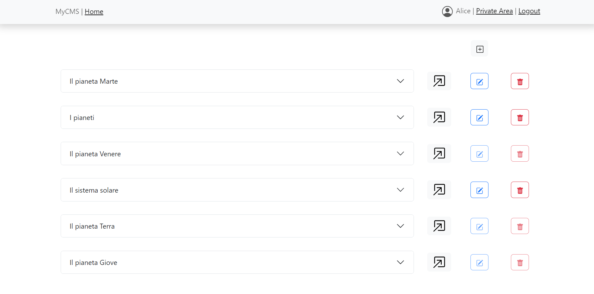
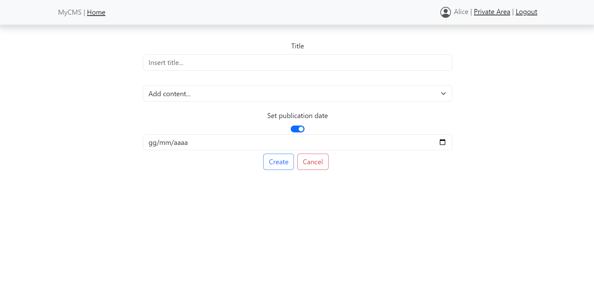

[](https://classroom.github.com/a/suhcjUE-)
# Exam #1: "CMSmall"
## Student: s301137 PAURI LUCA

## React Client Application Routes

- Route `/`: front office main page, shows the list of all the published pages with their properties
- Route `/:id`: shows the view of a specific published page, identified by the parameter id
- Route `/login`: login page to access back office
- Route `/back`: back office main page, shows the list of all the pages with their properties to a logged in user
- Route `/back/pages/:id`: shows the view of a specific page (even if not published yet), identified by the parameter id, to a logged in user
- Route `back/create` : shows the form to create a new page to a logged in user
- Route `back/edit/:id` : shows the form to edit a new page, identified by the parameter id, to a logged in user who is the author of the    page or an admin
- Route `*` : for all the non existent pages, shows a warning

## API Server

- GET `/api/pages/published`
  - Description : Get all the published pages
  - Request parameters : None
  - Request body : None
  - Response : `200 OK` (success) or `500 INTERNAL SERVER ERROR` (generic error)
  - Response body : 
  ```
  [
  {
    "id": 1,
    "title": "Il pianeta Venere",
    "authorId": 1,
    "creationDate": "2023-06-25",
    "publicationDate": "2023-06-25",
    "authorName": "enrico@test.com",
    "contents": [
      {
        "contentId": 1,
        "type": "Header",
        "content": "Il pianeta piu caldo",
        "positionId": 0
      },
      ...
    ]
    ...},
    ...
  ]
  ```
- GET `/api/pages/all`
  - Description : Get all the pages for a logged in user
  - Request parameters : None
  - Request body : None
  - Response : `200 OK` (success), `401 UNAUTHORIZED` (unauthorized) or `500 INTERNAL SERVER ERROR` (generic error)
  - Response body : 
  ```
  [
  {
    "id": 1,
    "title": "Il pianeta Venere",
    "authorId": 1,
    "creationDate": "2023-06-25",
    "publicationDate": "2023-06-25",
    "authorName": "enrico@test.com",
    "contents": [
      {
        "contentId": 141,
        "type": "Header",
        "content": "Il pianeta piu caldo",
        "positionId": 0
      },
      ...
    ]
    ...},
    ...
  ]
  ```
- GET `/api/images`
  - Description : Get all the image names
  - Request parameters : None
  - Request body : None
  - Response : `200 OK` (success), `401 UNAUTHORIZED` (unauthorized) or `500 INTERNAL SERVER ERROR` (generic error)
  - Response body : 
  ```
  [
  "Earth.jpg",
  "Venus.jpg",
  ...
  ]
  ```
- GET `/api/title`
  - Description : Get the website title
  - Request parameters : None
  - Request body : None
  - Response : `200 OK` (success) or `500 INTERNAL SERVER ERROR` (generic error)
  - Response body : 
  ```
  "My CMS"
  ```
- GET `/api/authors`
  - Description : Get a list of all users for an admin
  - Request parameters : None
  - Request body : None
  - Response : `200 OK` (success), `401 UNAUTHORIZED` (unauthorized) or `500 INTERNAL SERVER ERROR` (generic error)
  - Response body : 
  ```
  [
    {
        "id": 1,
        "email": "enrico@test.com"
    },
    ...
  ]
  ```
- PUT `/api/title`
  - Description : Sets the website title (admin only)
  - Request parameters : None
  - Request body : 
  ```
  {
    title : "MyCMS"
  }
  ```
  - Response : `200 OK` (success), `401 UNAUTHORIZED` (unauthorized), `422 UNPROCESSABLE ENTITY` (validation error) or `500 INTERNAL SERVER ERROR` (generic error)
  - Response body (success) : 
  ```
  1
  ```
- POST `/api/pages`
  - Description : Creates a new page (for logged in users)
  - Request parameters : None
  - Request body : 
  ```
  {
    "title" : "Il pianeta Venere",
    "creationDate" : "2023-04-18",
    "publicationDate" : "2023-05-19",
    "contents" : [
        {
            "type" : "Header",
            "content" : "Il pianeta più caldo",
            "positionId" : 1
        },
        ...
    ]
  }
  ```
  - Response : `200 OK` (success), `401 UNAUTHORIZED` (unauthorized), `422 UNPROCESSABLE ENTITY` (validation error) or `500 INTERNAL SERVER ERROR` (generic error)
  - Response body (success) : Returns page id
  ```
  1
  ```
- PUT `/api/pages/:id`
  - Description : Edits a page (for page author or admin)
  - Request parameters : id (page id)
  - Request body : 
  ```
  {
    "id" : "4",
    "title" : "Il pianeta Venere",
    "publicationDate" : "2022-06-20",
    "contents" : [
        {
            "type" : "Image",
            "content" : "Venus.jpg",
            "positionId" : 2
        },
        ...
    ]
  }
  ```
  - Response : `200 OK` (success), `401 UNAUTHORIZED` (unauthorized), `422 UNPROCESSABLE ENTITY` (validation error),`404 NOT FOUND` (page not found)  or `500 INTERNAL SERVER ERROR` (generic error)
  - Response body (success) : Number of modified pages
  ```
  1
  ```
- DELETE `/api/pages/:id`
  - Description : Deletes a page (for page author or admin)
  - Request parameters : id (page id)
  - Request body : None
  - Response : `200 OK` (success), `401 UNAUTHORIZED` (unauthorized), `422 UNPROCESSABLE ENTITY` (validation error),`404 NOT FOUND` (page not found)  or `500 INTERNAL SERVER ERROR` (generic error)
  - Response body (success) : Number of deleted pages
  ```
  1
  ```
- PUT `/api/pages/:id/author`
  - Description : Changes page author (for an admin)
  - Request parameters : id (page id)
  - Request body : 
  ```
  {
    "id" : "4",
    "authorId" : 1
  }
  ```
  - Response : `200 OK` (success), `401 UNAUTHORIZED` (unauthorized), `422 UNPROCESSABLE ENTITY` (validation error),`404 NOT FOUND` (page not found)  or `500 INTERNAL SERVER ERROR` (generic error)
  - Response body (success) : Number of modified pages
  ```
  1
  ```

- POST `/api/sessions`
  - Description: Create a new session from credentials.

  - Request body:
  ```
  {
    "username": "harry@test.com",
    "password": "pwd"
  }
  ```
  - Response: `200 OK` (success) or `500 Internal Server Error` (generic error).
  - Response body:
  ```
  {
    "username": "harry@test.com",
    "password": "pwd",
    "name": "Harry",
    "admin":0
  }
  ```
- GET `/api/sessions/current`

  - Description: Verify if the given session is still valid and return the info about the logged-in user. A cookie with a VALID SESSION ID must be provided to get the info of the user authenticated in the current session.

  - Request body: None 

  - Response: `200` (success) or `401 Unauthorized` (error).

  - Response body:
  ```
    {
      "username": "harry@test.com",
      "password": "pwd",
      "name": "Harry",
      "admin":0
    }
    ```

- DELETE `/api/sessions/current`
  - Description: Delete the current session. A cookie with a VALID SESSION ID must be provided.
  - Request body: None
  - Response: `200 OK` (success) or `500 Internal Server Error` (generic error).
  - Response body: None

  

## Database Tables

- Table `users` - (id, email, name, salt, password, admin) contains all the users data
- Table `pages` - (id, title, authorId, creationDate, publicationDate)  contains the properties of all the pages, publicationDate is null for draft pages.
- Table `contents` - (id, type, content, pageId, positionId) contains all the contents data, including the page id and an id which identifies the position of the content in the page
- Table `title` - (id,title) contains the title of the CMS
- Table `images` - (id, name) contains the name of the images, which are stored in the 'images' folder

## Main React Components

- `PageLayout` (in `PageLayout.jsx`): the component shows the layout of a page with its properties and the contents in order, in the back office the component shows a button to edit the page and another one to delete it (clickable only for the author and admins). There is also a button to navigate back to all the pages and another one to edit the author (only for admins).
- `Pages` (in `Pages.jsx`): the component shows the list of the published pages in the front office (with a button to navigate to the specific page) and of all the pages in the back office (with buttons to navigate, edit or delete the page, the last two clickable only by the author or by an admin). There is a button on top to create a new page (navigates to the form).
- `LoginForm` (in `LoginForm.jsx`): the component shows a form to log in, if the login is succesful it navigates to the back office.
- `MyForm` (in `Forms.jsx`): the component shows a form to create a new page or to edit an existing one. The user is able to specify a title, an optional publication date and as many contents as they like.
- `MyNavbar` (in `MyNavbar.jsx`): the component shows a navbar on top which is visible in all the pages. There is a button to navigate to the home page and another one to change the title (admin only). There is a login button if the user is not logged in, if the user is logged in the navbar shows a button the user info, a button to log out and another button to navigate to the back office

## Screenshot




## Users Credentials

- username : enrico@test.com, password : pwd, Admin
- username : luigi@test.com, password : pwd
- username : alice@test.com, password : pwd 
- username : harry@test.com, password : pwd  

